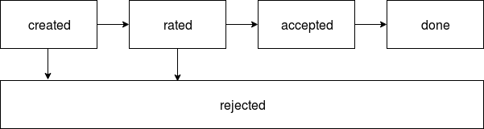

Billing documentation
=====================

Currency
--------

### Coins

**All currency units contain 100 coins.**
Regarding to the task we operate with
[**USD**](https://en.wikipedia.org/wiki/United_States_dollar),
[**EUR**](https://es.wikipedia.org/wiki/Euro),
[**CAD**](https://en.wikipedia.org/wiki/Canadian_dollar),
[**CNY**](https://en.wikipedia.org/wiki/Renminbi).
All that currency have 100 coins in one banknote unit.
There are also some coins that have 1000 coins in one banknote unit like Rupees, etc.
But we have to not complicate the task.

If you wanna work with other currencies which units contains another count of sub units, this schema should be change.
Probably you would like to store currency exponent value like 2 (100 cents in 1 dollar), 3 (1000 cents in 1 dollar), etc.

**We store all amounts in coins as int values.**
So let's store all amounts in cents as
integer value, and we can always be sure that real amount in currency unit value
is stored amount (in coins) / 100.

### Rate

In real life we can't take currency rate in real time.
So we probably would need to make a new transaction state:

A new transaction would contain just debit payment with partner_amount=NULL &
credit payment with amount=NULL. On rate gotten we could fill that fields and
move our transaction to the "rated" state.

But regarding to that task we can mock rates service and take needs rate
immediately with any load, so we don't implement that "rated" state, we take
the rate during transaction payments creation.
