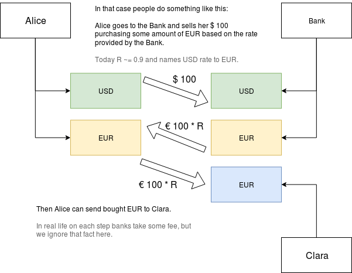

Billing documentation
=====================

Payments
--------

### One currency operations

Normally banks require wallets currency matching.

For example, we have two persons: Alice & Bob.
Both have USD wallets so, Alice can just simple send money
from her USD wallet to his USD wallet:

### Cross currency operations

Sometime the conterparty doesn't have any wallet in the same currency.

For example, we have two persons: Alice & Clara.
Alice still have her USD wallet. But Clara has only EUR wallet.

We have to store somewhere the information about currency change rate.

Normally banks proposes to do something like that:
1. Alice goes to the bank and opens EUR wallet.
2. Alice sells USD and purchases some amount of EUR.
3. Alice sends bought EUR to Clara's EUR wallet.

In our task we should complicate nothing.
So we will just store currency rate at the moment of transaction.

### Payments table

**tbl_payments**

| field                    | type     | comment                                            |
|:-------------------------|:--------:|:---------------------------------------------------|
| id                       | int      |                                                    |
| transaction_id           | uuid     |                                                    |
| created_at               | datetime | when the payment (and transaction) were created    |
| updated_at               | datetime | when the payment was modified last time            |
| payment_type             | int      | recharge, withdraw, transfer                       |
| payment_status           | int      | transaction can be done when all its payments done |
| client_id                | int      | this field is used to split data by shards         |
| wallet_id                | int      | client wallet                                      |
| currency                 | int      | client wallet currency                             |
| amount                   | int      | in client wallet currency                          |
| partner_client_id        | int      | counter party                                      |
| partner_wallet_id        | int      | partner wallet                                     |
| partner_currency         | int      | partner wallet currency                            |
| partner_amount           | int      | in partner wallet currency                         |
| exchange_rate            | int      | exchange rate: debit currency to credit currency   |

When the client pays (debit payment):
* amount < 0
* partner_amount > 0
* exchange_rate = rate of client wallet currency to partner wallet currency
  (client sells his currency to buy partner's currency and send him it)

When the client receives money (credit payment):
* amount > 0
* partner_amount < 0
* exchange_rate = rate of partner wallet currency to client wallet currency
  (partner sells his currency to buy client's currency and send him it)

This table is denormalized.
So we need to create 2 payments per transaction to make possible split clients data in different shards.

Both payments have the same transaction_id.
The first payment client_id is the payer id & partner_client_id is the receiver id.
The second payment client_id is the receiver id & partner_client_id is the payer id.
