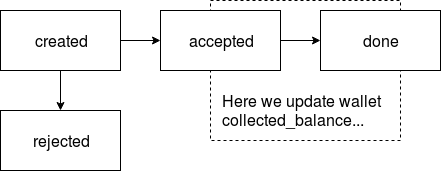

Billing documentation
=====================

Wallets
-------

### Currency

The wallet exists per pair of (client_id, currency).
Regarding to the task, each client has just one wallet (in some currency).
But we can easily register more wallets in other currencies for the client.

In real life client can have more than 1 wallet in the same currency.
But here we shouldn't complicate things.

### Balance

In each moment of time the wallet balance is a sum of:
* updated wallet's balance value writen in the wallet record (by default is 0)
* amounts of all payments marked as accepted (and still not done)
  with that wallet_id

Some periodic job runs per wallet, take all accepted payments by wallet_id.
Then it updates wallet's record balance value adding the sum of accepted
payments amount,bit also marks all that payments as done
(and we shouldn't process them by that job again).

### Potential balance

In each moment of time the potentia wallet balance is a sum of:
* wallet balance (see above)
* amounts of all payments marked as created with that wallet_id

It's just a way to estimate the future possible balance.

Probably, you also would like to make hypothesis about
potential balance in 5 minutes, in 1 hour, etc.
In that case you would need to filter created payments
by their average left time to be marked as accepted.

### Wallets table

**tbl_wallets**

| field                    | type     | comment                                            |
|:-------------------------|:--------:|:---------------------------------------------------|
| id                       | uuid     |                                                    |
| created_at               | datetime | when the payment (and transaction) were created    |
| updated_at               | datetime | when the payment was modified last time            |
| client_id                | uuid     | this field is used to split data by shards         |
| currency                 | varchar  | client wallet currency iso-4217 string code        |
| collected_balance        | int      | processed "collected" part (see above)             |

We could use iso-4217 numeric code, but we use string value to simplify all.
